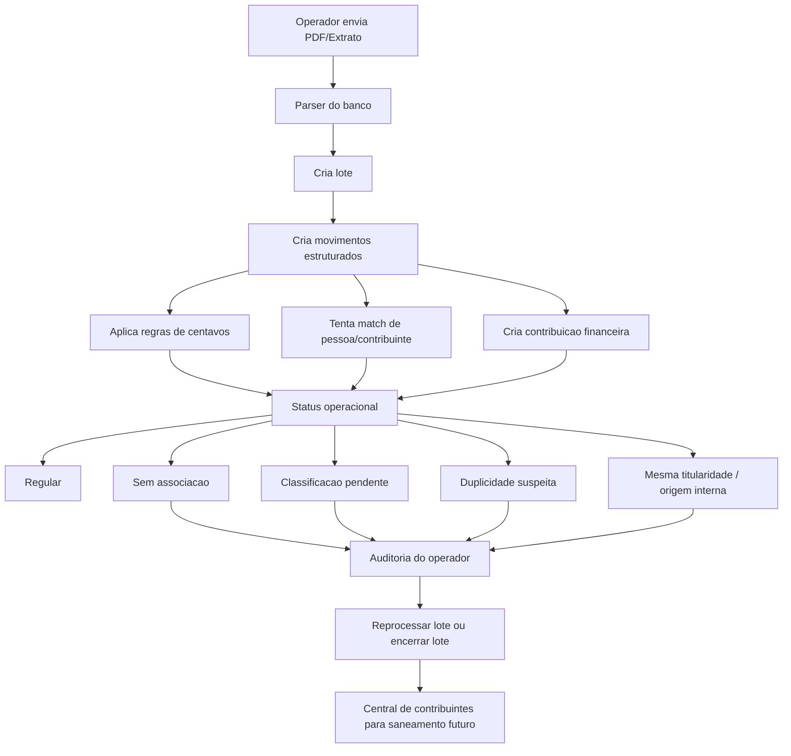

# Guia De Importacoes Bancarias V1

## 1. Objetivo

Este documento existe para evitar retrabalho na evolucao dos importadores bancarios do Power Church.

A regra daqui para frente e:

- cada banco novo ganha parser proprio;
- banco novo nasce no Django e no nucleo portavel, sem criar nova dependencia operacional no prototipo antigo;
- a leitura portavel deve ser homologada pela chave segura Swift/PyMuPDF antes de uso definitivo;
- o motor operacional e financeiro deve ser reaproveitado;
- a interface do operador deve permanecer o mais identica possivel;
- saneamento, centavos, contribuinte auxiliar e associacao a pessoa nao devem ser reinventados a cada banco.

Hoje esta base ja foi validada com:

- PIX Sicoob
- Extrato Bradesco

## 2. Principio Arquitetural

Separar sempre:

1. origem bancaria
2. parser do documento
3. motor compartilhado de saneamento
4. financeiro consolidado
5. central de importacoes

Em termos praticos:

- o que muda por banco: leitura do PDF, texto, colunas, identificadores, nomes e tipos de lancamento;
- o que nao muda: lote, contribuinte auxiliar, contribuicao financeira, centavos, filtros, pendencias, associacao, encerramento do lote.
- durante a transicao, bancos ja existentes podem usar fallback legado; bancos novos devem usar a Central Django como tela principal desde o inicio.

## 3. O Que E Compartilhado Entre Bancos

Todo banco novo deve seguir os mesmos pilares abaixo.

### 3.1 Central De Importacoes

Entrada unificada:

- `Central de importacoes`
- resumo dos lotes
- upload por origem bancaria
- tabela de centavos ativa
- links para lotes recentes

### 3.2 Regras De Centavos

A tabela de centavos e unica para todo o sistema.

Codigos atuais:

- `01` Acao Social
- `02` Missoes Nacionais
- `03` Missoes Mundiais
- `04` Missoes Igreja
- `05` Juventude
- `06` Adolescentes
- `07` Musica
- `08` Homens
- `09` Embaixadores
- `10` Mensageiras
- `11` Campanha Especial
- `12` Mulheres

Regra operacional:

- fora dos codigos especiais: `Dizimo default`
- dentro dos codigos especiais: `revisar_destinacao`

### 3.3 Financeiro Imediato

Todo credito valido que entra no escopo da importacao:

- gera contribuicao financeira
- nunca fica fora do sistema

O que fica pendente nao e o dinheiro.
O que fica pendente e o saneamento operacional:

- associacao a pessoa
- classificacao por centavos
- duplicidade
- mesma titularidade / origem interna

### 3.4 Contribuinte Auxiliar

Toda remessa precisa ficar ligada a um contribuinte, mesmo sem pessoa vinculada.

Isso permite:

- nao perder historico
- reprocessar no futuro
- enxergar recorrencia
- transformar em frequentador depois
- vincular retroativamente a uma pessoa

### 3.5 Associacao A Pessoa

A associacao a pessoa e uma camada separada do financeiro.

Estados principais:

- pessoa vinculada
- contribuinte auxiliar sem pessoa
- mesma titularidade / origem interna

### 3.6 NR Revisado No Lote

Quando o operador decide:

- `manter sem pessoa vinculada`

isso significa:

- o movimento continua valido no financeiro
- o contribuinte auxiliar e preservado
- ele sai da fila de pendencia de associacao naquele lote

Mas essa decisao nao pode sumir com casos futuros do mesmo nome em outros lotes.

Regra:

- a decisao `NR revisado` vale para o lote atual
- ela pode se propagar para ocorrencias iguais no mesmo lote
- ela nao deve impedir que o mesmo nome reapareca em um lote futuro

### 3.7 Busca Ampla Na Auditoria

A busca manual da auditoria deve consultar o cadastro inteiro:

- membro ativo
- membro inativo
- frequentador
- visitante
- arquivo morto

Ela deve aparecer com destaque visual separado do motor automatico.

### 3.8 Mesma Titularidade / Origem Interna

Quando o movimento e transferencia entre contas da propria igreja:

- nao e doacao
- nao deve ir para associacao de pessoa
- nao deve sumir da trilha de auditoria

Fluxo correto:

- classificar como `mesma_titularidade / origem_interna`
- desativar a contribuicao de doacoes
- deixar o movimento em `Ignorados`
- preservar o historico bancario

### 3.9 Ordenacao E Navegacao

Padrao visual comum:

- `Todos` = ordem cronologica do mais recente para o mais antigo
- filas de saneamento = prioridade operacional
- lista de lotes = ultimo lote criado primeiro

Padrao de navegacao:

- ao sair da auditoria, voltar para o mesmo filtro do lote
- nao jogar o operador sempre em `saneamento geral`

## 4. Fluxo Compartilhado

## 5. O Que E Especifico De Cada Banco

Cada banco precisa definir apenas sua camada de parser e classificacao primaria.

Itens tipicos por banco:

- como localizar datas
- como localizar valor credito
- como localizar debito
- se existe nome do remetente
- se existe documento mascarado
- se existe numero interno da transacao
- se ha linhas de continuidade
- se ha quebra de pagina
- quais prefixos sao relevantes
- quais tipos devem ser ignorados

Exemplos:

- Sicoob PIX: documento mascarado e forte para matching
- Bradesco extrato: `Docto` e referencia interna, nao CPF/CNPJ

## 6. Contrato Minimo Para Banco Novo

Todo banco novo deve entregar, no minimo, movimentos com estes campos logicos:

- data do movimento
- competencia
- valor
- nome de origem, se existir
- nome normalizado
- codigo de centavos
- tipo/canal do movimento
- identificador interno do banco, se existir
- texto bruto
- assinatura global

Mesmo que o banco nao entregue tudo, o importador deve tentar preencher esse contrato.

## 7. Padrao De Telas

Toda origem bancaria nova deve reproduzir, tanto quanto possivel:

### 7.1 Tela Inicial

- resumo do modulo
- upload do documento
- lotes recentes
- tabela de centavos ativa

### 7.2 Tela Do Lote

- resumo com cards
- filtros:
  - saneamento geral
  - pendencia de associacao
  - saneamento pessoa
  - saneamento destinacao
  - destinacoes especiais
  - saneamento duplicidade
  - ignorados
  - todos
- acao de reprocessar
- acao de encerrar lote

### 7.3 Tela Do Movimento

- movimento bancario
- texto bruto
- sugestoes
- busca ampla manual
- confirmacao de pessoa
- manter sem pessoa
- ignorar
- mesma titularidade quando aplicavel

## 8. Regras De Homologacao

Um banco novo so deve ser considerado pronto quando passar nestes pontos:

1. cria lote sem erro
2. cria movimentos com contagem e total coerentes
3. nao perde nomes por quebra de linha
4. nao troca nomes por quebra de pagina
5. nao troca valores entre movimentos
6. aplica centavos corretamente
7. cria contribuicoes financeiras
8. separa pendencia de associacao de forma coerente
9. busca ampla da auditoria retorna o cadastro inteiro
10. `NR revisado` sai da fila do lote atual
11. `NR revisado` pode reaparecer em lote futuro
12. `mesma_titularidade` vai para `Ignorados`
13. reprocessamento preserva trabalho manual
14. retorno da auditoria volta ao mesmo filtro do lote
15. lote encerrado continua saneamento na central de contribuintes
16. central Django mantem `Comparar Swift x PyMuPDF` como padrao seguro enquanto houver dois motores
17. central Django mostra `Abrir lote` de forma explicita para cada lote
18. telas do banco novo passam no contrato visual Django antes de entrega ao operador

## 9. Estrategia Recomendada Para Os Proximos Bancos

Melhor caminho pratico:

1. receber 1 ou 2 extratos reais do banco
2. analisar padrao do PDF
3. mapear o que e confiavel no documento
4. criar parser dedicado
5. plugar na central
6. reaproveitar o motor compartilhado
7. homologar com este guia

## 10. Decisao De Produto

Daqui para frente, o Power Church deve crescer assim:

- `1 central de importacoes`
- `N parsers bancarios`
- `1 motor compartilhado de saneamento`

Isso faz o sistema ficar:

- mais profissional
- mais rapido para evoluir
- menos sujeito a retrabalho
- mais facil de operar pela secretaria/financeiro

## 11. Regra De Ouro

Quando entrarmos com um novo banco, a pergunta nao deve ser:

- `como fazemos tudo de novo para esse banco?`

Deve ser:

- `o que este banco entrega de diferente no parser para encaixar no motor que ja existe?`
